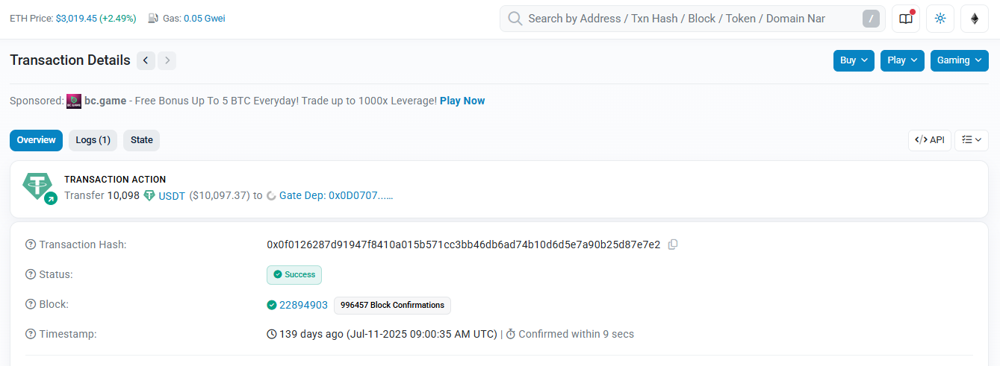
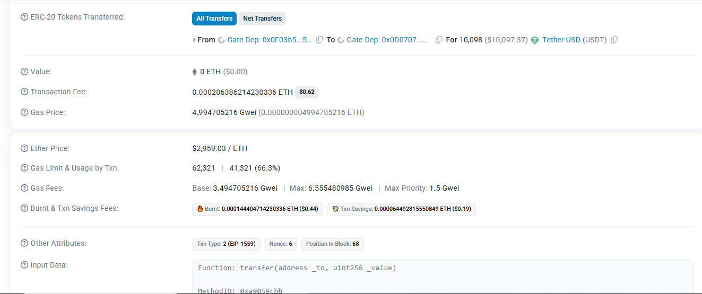
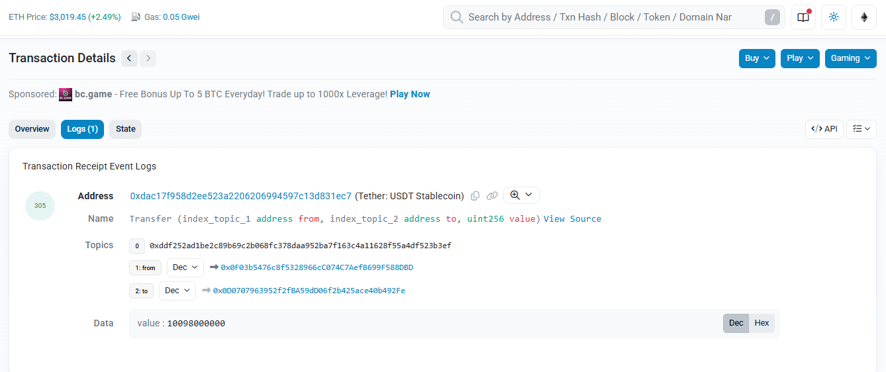

# Transaction Analysis Assignment
**Student Name:** Joshua Awolaye  
**Date:** November 19, 2025  
**Blockchain:** Ethereum Mainnet

---

## 1. Transaction Overview

**Etherscan Link:** [View on Etherscan](https://etherscan.io/tx/0x0f0126287d91947f8410a015b571cc3bb46db6ad74b10d6d5e7a90b25d87e7e2)

**Transaction Summary:**  
This transaction represents a USDT (Tether stablecoin) transfer between two Gate.io exchange deposit addresses. The sender transferred 10,098 USDT tokens from one Gate.io deposit wallet to another, likely as part of internal exchange operations or fund consolidation. This is a common pattern for centralized exchanges managing user funds across multiple wallet addresses.

---

## 2. Basic Information

| Field | Value |
|-------|-------|
| **Transaction Hash** | `0x0f0126287d91947f8410a015b571cc3bb46db6ad74b10d6d5e7a90b25d87e7e2` |
| **Status** | ✅ Success |
| **Timestamp** | Jul-11-2025 09:00:35 AM UTC (139 days ago) |
| **Block Number** | 22894903 |
| **Block Confirmations** | 996,075 |
| **Position in Block** | 68 |
| **Confirmation Time** | 9 seconds |

**What this means:**  
The transaction was successfully executed and included in block 22894903. With nearly 1 million confirmations, this transaction is permanently and irreversibly recorded on the Ethereum blockchain. Being confirmed within 9 seconds indicates the sender paid an adequate gas price during a period of moderate network activity.

---

## 3. Parties Involved

### Sender (From Address)
| Field | Details |
|-------|---------|
| **Address** | `0x0F03b5476c8f5328966cC074C7Aef8699F588DBD` |
| **Label** | Gate Dep: 0x0F03b5...588DBD |
| **Type** | Smart Contract |
| **ETH Balance** | 0.003208284557449822 ETH |
| **Transaction Count** | 13 transactions |
| **Primary Activity** | Token transfers (exchange operations) |

### Contract Interacted With (To Address)
| Field | Details |
|-------|---------|
| **Address** | `0xdAC17F958D2ee523a2206206994597C13D831ec7` |
| **Contract Name** | Tether: USDT Stablecoin |
| **Type** | ERC-20 Token Contract |
| **Function Called** | `transfer(address _to, uint256 _value)` |

### Actual Token Recipient
| Field | Details |
|-------|---------|
| **Address** | `0x0D0707963952f2fBA59dD06f2b425ace40b492Fe` |
| **Label** | Gate Dep: 0x0D0707...b492Fe |
| **Type** | Smart Contract |
| **ETH Balance** | 42 wei (0.000000000000000042 ETH) |
| **Transaction Count** | 278,577,035 transactions |
| **Nature** | High-volume exchange deposit address |

**Analysis:**  
Both the sender and recipient are Gate.io exchange addresses, indicating this is an internal transfer. The recipient address has processed over 278 million transactions, confirming it's a major exchange hot wallet or deposit address. The minimal ETH balances are typical for addresses that primarily handle token transfers rather than native ETH.

---

## 4. Value & Fees

### Transfer Value
| Asset | Amount | USD Value (at time of transaction) |
|-------|--------|-------------------------------------|
| **USDT Transferred** | 10,098 USDT | $10,097.37 |
| **ETH Transferred** | 0 ETH | $0.00 |

### Gas & Fee Breakdown

| Metric | Value | Notes |
|--------|-------|-------|
| **Transaction Fee** | 0.000206386214230336 ETH | $0.62 USD |
| **Gas Price** | 4.994705216 Gwei | 0.000000004994705216 ETH per gas unit |
| **Gas Limit** | 62,321 | Maximum gas allocated |
| **Gas Used** | 41,321 | Actual gas consumed |
| **Gas Usage Efficiency** | 66.3% | Gas used / Gas limit |
| **Base Fee** | 3.494705216 Gwei | Network base fee (EIP-1559) |
| **Max Priority Fee** | 1.5 Gwei | Tip to validators |
| **Max Fee Per Gas** | 6.555480985 Gwei | Maximum willing to pay |
| **Burnt Fees** | 0.000144404714230336 ETH | $0.43 (sent to null address) |
| **Txn Savings** | 0.000064492815550849 ETH | $0.19 (saved vs max fee) |

### Cost Comparison

| Context | Gas Price | Comparison |
|---------|-----------|------------|
| **This Transaction** | 4.99 Gwei | Transaction gas price |
| **Current Network Average** | 0.05 Gwei | Much lower (99% cheaper) |
| **ETH Price (Transaction Time)** | ~$2,959.03 | Historical price |
| **ETH Price (Current)** | $3,019.45 | +2.04% since transaction |

**Fee Analysis:**  
At the time of this transaction, the sender paid 4.99 Gwei for gas, which was reasonable for the network conditions on July 11, 2025. However, compared to today's ultra-low gas prices of 0.05 Gwei, this transaction was executed during a period of higher network congestion. The total fee of $0.62 is still very affordable for a $10,097 transfer (0.006% fee rate), demonstrating one of Ethereum's advantages for high-value transfers.

---

## 5. Technical Details

### Transaction Type & Parameters
| Field | Value |
|-------|-------|
| **Transaction Type** | Type 2 (EIP-1559) |
| **Nonce** | 6 |
| **Method ID** | `0xa9059cbb` |
| **Function Signature** | `transfer(address _to, uint256 _value)` |

### Input Data Analysis

**Raw Input Data:**
```
Function: transfer(address _to, uint256 _value)

MethodID: 0xa9059cbb
[0]: 0000000000000000000000000d0707963952f2fba59dd06f2b425ace40b492fe
[1]: 0000000000000000000000000000000000000000000000000000000259e34080
```

**Decoded Parameters:**
- **Parameter [0] - Recipient Address:** `0x0D0707963952f2fBA59dD06f2b425ace40b492Fe`
- **Parameter [1] - Transfer Amount:** `0x0259e34080` (hexadecimal) = 10,098,000,000 (with 6 decimals) = 10,098 USDT

**Technical Explanation:**  
This transaction called the `transfer` function on the USDT smart contract. The ERC-20 standard defines this function to move tokens from the caller's address to a recipient. The input data encodes two parameters: the destination address and the amount in the token's smallest unit (USDT uses 6 decimal places, so 10,098 USDT = 10,098,000,000 base units).

### Tokens Transferred

| From | To | Amount | Token | USD Value |
|------|-----|--------|-------|-----------|
| Gate Dep: 0x0F03b5...588DBD | Gate Dep: 0x0D0707...b492Fe | 10,098 | USDT (Tether USD) | $10,097.37 |

### Events Emitted

**Event Count:** 1 event emitted

**Event #305 - Transfer Event:**
- **Contract:** `0xdac17f958d2ee523a2206206994597c13d831ec7` (Tether: USDT Stablecoin)
- **Event Name:** Transfer
- **Event Signature:** `Transfer(index_topic_1 address from, index_topic_2 address to, uint256 value)`

**Event Topics:**
```
Topic 0: 0xddf252ad1be2c89b69c2b068fc378daa952ba7f163c4a11628f55a4df523b3ef
Topic 1 (from): 0x0F03b5476c8f5328966cC074C7Aef8699F588DBD
Topic 2 (to): 0x0D0707963952f2fBA59dD06f2b425ace40b492Fe
```

**Event Data:**
- **Value:** 10,098,000,000 (in base units, equals 10,098 USDT)

**What are Events?**  
Events are logs emitted by smart contracts to record important state changes. The Transfer event is a standard ERC-20 event that gets triggered whenever tokens move between addresses. These events are indexed and searchable, making it easy to track token movements across the blockchain.

---

## 6. Analysis & Insights

### Transaction Purpose
This transaction was an **internal exchange transfer** where Gate.io moved USDT between two of its deposit addresses. This is a common practice for centralized exchanges to:
- Consolidate funds for liquidity management
- Redistribute tokens across hot wallets
- Prepare for user withdrawals
- Balance funds across different operational wallets

### Gas Efficiency Assessment

**Was the gas price reasonable?**  
Yes, for the network conditions at the time. At 4.99 Gwei, this transaction was priced appropriately for July 11, 2025 network activity. The sender used EIP-1559 pricing with a 1.5 Gwei priority fee, indicating they wanted relatively fast confirmation without overpaying.

**Could the sender have saved on gas?**

1. **Gas Limit Optimization:** The transaction set a gas limit of 62,321 but only used 41,321 (66.3%). While this 20,000 gas buffer seems wasteful, unused gas is refunded, so this didn't cost extra. However, a tighter limit (e.g., 45,000) would have reduced risk exposure with minimal savings.

2. **Timing Optimization:** Compared to current gas prices (0.05 Gwei), the sender paid 99.9% more. If this transfer wasn't time-sensitive, waiting for lower network activity could have reduced fees from $0.62 to less than $0.01.

3. **Batch Transactions:** If Gate.io had multiple transfers to execute, batching them into a single multi-send transaction could reduce per-transfer costs.

**Actual Savings Achieved:**  
The transaction saved $0.19 (0.000064 ETH) by using EIP-1559's dynamic fee mechanism instead of paying the maximum fee specified.

### Sender Profile Analysis

**Address:** `0x0F03b5476c8f5328966cC074C7Aef8699F588DBD`

**Key Observations:**
- **Low transaction count (13):** This is a relatively new or specialized address, not a primary operational wallet
- **Minimal ETH balance:** 0.003 ETH is just enough for gas fees, typical of addresses that primarily handle tokens
- **Contract-based:** Being a smart contract rather than an EOA suggests this is a programmatic wallet with specific transfer rules or permissions
- **Single-purpose activity:** Focused exclusively on token transfers, likely automated exchange operations
- **Gate.io infrastructure:** Part of Gate.io's multi-address architecture for security and operational compartmentalization

### Receiver Profile Analysis

**Address:** `0x0D0707963952f2fBA59dD06f2b425ace40b492Fe`

**Key Observations:**
- **Extremely high transaction count (278+ million):** This is a major exchange hot wallet handling massive transaction volume
- **Nearly zero ETH balance (42 wei):** Despite high activity, keeps minimal ETH, likely sweeping excess to cold storage
- **Contract address:** Programmable wallet with likely security features like multi-sig or time locks
- **Central exchange infrastructure:** This is clearly a core operational address for Gate.io, processing millions of user deposits and withdrawals
- **High trust address:** The volume indicates this address is central to Gate.io's operations and has been active for an extended period

### Security & Trust Indicators

✅ **Positive Signals:**
- Both addresses are verified Gate.io addresses
- Transaction succeeded without errors
- Standard ERC-20 transfer pattern
- Reasonable gas pricing
- Clean event logs with no suspicious activity

⚠️ **Considerations:**
- Centralized exchange addresses represent custodial control (Gate.io controls the private keys, not individual users)
- High transaction volume on receiver suggests it's a hot wallet (more vulnerable than cold storage)
- Contract-based wallets have additional complexity and potential vulnerabilities

---

## 7. Screenshots

### Screenshot 1: Main Transaction Overview

*Shows transaction hash, status, block number, timestamp, and basic transfer details*

**Key Elements Visible:**
- Success status with green checkmark
- Block 22894903 with 996,457+ confirmations
- Transaction action: Transfer 10,098 USDT to Gate Dep address
- Timestamp: 139 days ago (Jul-11-2025)

### Screenshot 2: Value, Fees & Technical Details

*Displays ERC-20 token transfer, ETH value, transaction fees, gas details, and input data*

**Key Elements Visible:**
- ERC-20 Tokens Transferred: 10,098 USDT ($10,097.37)
- Transaction Fee: 0.000206 ETH ($0.62)
- Gas Price: 4.99 Gwei
- Gas Limit & Usage: 62,321 / 41,321 (66.3%)
- Gas Fees breakdown with base fee and max priority fee
- Burnt & savings fees showing EIP-1559 efficiency
- Transaction Type 2 (EIP-1559)
- Input Data: transfer(address _to, uint256 _value) function

### Screenshot 3: Event Logs

*Shows the Transaction Receipt Event Logs with the Transfer event details*

**Key Elements Visible:**
- Event #305: Transfer event from USDT contract
- Address: Tether USDT Stablecoin contract
- Event signature with indexed topics (from and to addresses)
- Data field showing transfer value: 10,098,000,000 (base units)
- Topics showing source and destination addresses

---

## 8. Key Takeaways

### 1. **ERC-20 Token Transfers Are Different from ETH Transfers**
Unlike sending ETH directly, token transfers require interacting with a smart contract. This means:
- You pay gas fees in ETH even when transferring tokens
- The transaction calls a function on the token's contract
- Events are emitted to record the transfer
- Gas costs are higher than simple ETH transfers

### 2. **Exchange Architecture Uses Multiple Addresses**
Gate.io doesn't use a single address for all operations. Instead:
- Different addresses handle different functions (deposits, withdrawals, cold storage)
- Internal transfers between exchange addresses are common
- High-volume addresses (278M+ transactions) are hot wallets
- Low-transaction addresses are likely specialized or newer wallets

### 3. **EIP-1559 Provides Fee Optimization**
This transaction used EIP-1559's improved fee mechanism:
- Set a maximum fee willing to pay (6.55 Gwei)
- Only paid what was necessary (4.99 Gwei)
- Saved $0.19 automatically
- Base fee gets burned, reducing ETH supply
- Priority fee tips validators for faster inclusion

### 4. **Gas Prices Vary Dramatically Over Time**
Transaction timing matters for cost:
- This transaction: 4.99 Gwei ($0.62)
- Current network: 0.05 Gwei (~$0.006)
- Same transaction today would cost 99% less
- Non-urgent transactions benefit from patience

### 5. **On-Chain Transparency Is Powerful**
Everything is visible and verifiable:
- Can track funds between addresses
- Can analyze exchange operational patterns
- Can verify transaction authenticity
- Can audit smart contract interactions
- Public accountability for all parties

### 6. **Smart Contract Interactions Follow Patterns**
The input data follows a predictable structure:
- Method ID identifies the function (0xa9059cbb = transfer)
- Parameters are encoded in hexadecimal
- Data is deterministic and verifiable
- Anyone can decode and understand the transaction

### 7. **Blockchain Confirmations Provide Security**
With 996,075+ confirmations:
- Transaction is irreversible
- Becomes exponentially more secure over time
- Part of Ethereum's immutable history
- Would require massive resources to alter

### 8. **Reading Blockchain Data Requires Context**
Numbers need interpretation:
- 42 wei sounds like a lot but equals ~$0.0000000001
- 278M transactions indicates a major operational address
- USDT has 6 decimals, so values need conversion
- Hexadecimal data must be decoded to understand parameters

---

## 9. Questions I Still Have

### Technical Questions

1. **Why does the USDT contract use 6 decimals instead of 18 like most ERC-20 tokens?**
   - Most ERC-20 tokens use 18 decimals (like ETH), but USDT uses 6. Is this related to matching traditional currency conventions (dollars and cents with 2 decimals)?

2. **What determines the gas limit for a transaction?**
   - How did the sender know to set a gas limit of 62,321? Is this estimated by the wallet software, or is there a formula based on the function being called?

3. **Why does the receiver address have exactly 42 wei?**
   - This seems like an oddly specific number. Was this intentional, or just leftover from transaction fees?

4. **How does EIP-1559 calculate the base fee?**
   - The base fee was 3.49 Gwei—what network conditions or algorithm determines this number?

5. **What happens to the burnt fees?**
   - The $0.43 in burnt fees is sent to a null address. Does this permanently remove ETH from circulation, and what impact does this have on ETH's total supply?

### Operational Questions

6. **Why would Gate.io transfer funds between its own addresses?**
   - What operational reasons require moving tokens from one Gate.io wallet to another? Is this for security, liquidity management, or regulatory compliance?

7. **How do exchanges manage so many addresses?**
   - With one address handling 278M+ transactions and others handling just 13, what's the organizational strategy?

8. **Are exchange addresses multi-signature?**
   - Given the high value stored in these addresses, do they require multiple parties to approve transactions?

### Security & Risk Questions

9. **What are the risks of using a contract address versus an EOA?**
   - Both the sender and receiver are smart contracts. What additional vulnerabilities or benefits does this create?

10. **How can I verify an address truly belongs to Gate.io?**
    - Etherscan shows the label, but how can I independently confirm this address is legitimately controlled by Gate.io?

### Economic Questions

11. **How much does Gas.io spend on transaction fees annually?**
    - With hundreds of millions of transactions, what's the total gas cost for an exchange of this size?

12. **Why didn't the sender wait for lower gas prices?**
    - The transaction could have cost 99% less if executed today. Was the 9-second confirmation time worth the extra $0.61?

---

## 10. How This Knowledge Helps Me as a Creative

As a **content editor, ghostwriter, proofreader, content writer, and SEO content writer** entering Web3, understanding blockchain transactions gives me several professional advantages:

### 1. **Creating Accurate Web3 Content**
- I can now write technically accurate articles about blockchain transactions, gas fees, and smart contracts
- I understand the terminology well enough to fact-check content from clients and avoid spreading misinformation
- I can explain complex concepts (like EIP-1559 or ERC-20 transfers) in accessible language for general audiences
- This analysis trained me to break down technical topics into digestible sections—a crucial skill for content writing

### 2. **SEO Strategy for Web3 Brands**
- Understanding transaction data helps me identify what users search for: "how to save gas fees," "what are blockchain confirmations," "ERC-20 vs ETH transfer"
- I can create content that answers real questions people have when using blockchain products
- I know which technical details matter to users (gas fees, confirmation times) vs what's just noise
- This knowledge helps me write meta descriptions and title tags that accurately reflect blockchain content

### 3. **Building Trust with Web3 Clients**
- When ghostwriting for Web3 founders, developers, or projects, I can speak their language
- I won't make embarrassing mistakes like confusing gas limits with gas prices or thinking token transfers don't cost ETH
- I can ask intelligent questions during client briefings and understand their answers
- Clients will trust me to represent their technical products accurately

### 4. **Content Research & Verification**
- I can now use Etherscan as a primary research tool for writing case studies or articles about specific projects
- I can verify claims made by Web3 projects by examining their on-chain activity
- I understand how to find relevant examples and data points to support my writing
- I can fact-check other writers' work on blockchain topics

### 5. **Creating Diverse Content Types**
- **How-to Guides:** "How to Read an Etherscan Transaction" or "Understanding Your Crypto Transaction Fees"
- **Explainers:** "What Are ERC-20 Tokens?" or "EIP-1559: How Ethereum Gas Fees Work"
- **Case Studies:** Analyzing interesting transactions or smart contract interactions
- **Glossaries:** Creating accurate definitions of blockchain terms
- **Comparison Articles:** "Gas Fees on Ethereum vs Other Blockchains"

### 6. **Understanding User Pain Points**
- This exercise showed me that gas fees are complex and confusing—content that simplifies this will have high value
- Users need help understanding when to transact (timing for lower fees)
- There's confusion around ETH vs token transfers—education content needed here
- Explaining "why my transaction cost more than my friend's" is valuable content

### 7. **Translation Skills for Technical Topics**
Just like I broke down this transaction into understandable sections, I can:
- Translate developer documentation into user-friendly guides
- Convert whitepaper technical jargon into marketing copy
- Explain smart contract functionality for non-technical audiences
- Make blockchain concepts accessible without losing accuracy

### 8. **Future Content Opportunities**
This knowledge opens doors to write for:
- Cryptocurrency exchanges (explainer content, help documentation)
- Wallet providers (user guides, security content)
- NFT platforms (transaction guides, gas optimization tips)
- DeFi protocols (educational content about smart contract interactions)
- Blockchain explorers (tooltips, help articles, feature explanations)
- Web3 education platforms (courses, tutorials, learning materials)

### 9. **Analyzing Content Performance On-Chain**
- I can now track on-chain metrics for NFT drops or token launches I write about
- I can use transaction data to inform content strategy (what's actually being used?)
- I understand how to verify claims about transaction volume, user activity, etc.
- This data literacy extends my analytics skills beyond traditional web analytics into on-chain analytics

### 10. **Personal Brand Building**
- I can position myself as a "Web3-literate content professional"
- I can create portfolio pieces demonstrating technical understanding
- This analysis itself is a portfolio piece showing my ability to research, analyze, and communicate complex topics
- I'm building expertise in a growing field with increasing content demands

---

## Conclusion

This transaction analysis exercise transformed a complex hexadecimal hash into a comprehensive story about value transfer, network mechanics, and exchange operations. By systematically breaking down each component—from basic timestamps to intricate gas fee calculations—I gained practical insight into how Ethereum transactions work at both technical and operational levels.

The most valuable insight is that blockchain transparency makes everything auditable and understandable with the right tools and knowledge. What seemed like cryptic addresses and mysterious gas fees at the start is now a clear picture of a $10,097 USDT transfer executed efficiently between Gate.io addresses for $0.62 in fees.

As I continue my Web3 journey, this foundational understanding of transaction anatomy will inform every piece of content I create, every client conversation I have, and every blockchain interaction I make. The blockchain doesn't hide information—it simply requires the knowledge to read it.